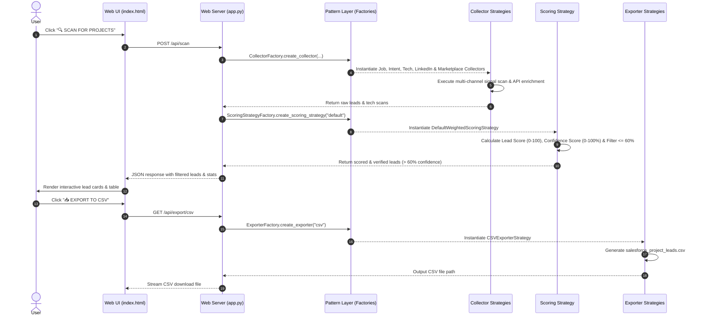

# 🏗️ Architecture Documentation: Salesforce Lead Generation Engine

## 1. System Overview

The **Salesforce Lead Generation Engine** is a signal-based market intelligence platform designed for Salesforce consulting agencies, system integrators, AppExchange partners, and freelance developers/architects.

The system automatically discovers high-intent B2B buying signals (job hiring posts, RFPs, web tech stack footprints, and marketplace contracts), enriches contact details via free-tier B2B APIs and directory scrapers, calculates dual score metrics (**Lead Score** and **Confidence Score**), and formats personalized outreach pitches.

---

## 2. Core Design Patterns & Architectural Principles

The architecture strictly adheres to standard Object-Oriented Software Design Patterns and SOLID principles:

```
                      ┌──────────────────────────────────────────────┐
                      │    Presentation Layer (main.py / app.py)      │
                      └──────────────────────┬───────────────────────┘
                                             │
                                             ▼
                      ┌──────────────────────────────────────────────┐
                      │   Pattern Layer (Factories & Strategies)    │
                      │  - CollectorFactory -> ICollectorStrategy    │
                      │  - ScoringStrategyFactory -> IScoringStrat   │
                      │  - ExporterFactory -> IExporterStrategy      │
                      └──────┬───────────────────────┬───────────────┘
                             │                       │
           ┌─────────────────┴─────────┐   ┌─────────┴─────────────────┐
           ▼                           ▼   ▼                           ▼
┌──────────────────────┐    ┌──────────────────────┐    ┌──────────────────────┐
│  src/collectors/     │    │   src/processing/    │    │     src/export/      │
│  - Job Signals       │    │  - LeadScorer        │    │  - CSV Exporter      │
│  - Intent / RFPs     │    │  - OutreachGenerator │    │  - JSON Exporter     │
│  - Tech Footprint    │    └──────────────────────┘    │  - Salesforce CRM    │
│  - Free-Tier APIs    │                                └──────────────────────┘
│  - LinkedIn Scrapers │
│  - Marketplace Feed  │
└──────────────────────┘
```

### Key Principles:

1. **Strategy Design Pattern (`src/patterns/strategies/`)**
   - Encapsulates execution algorithms into interchangeable strategy classes implementing common interfaces (`ICollectorStrategy`, `IScoringStrategy`, `IExporterStrategy`).
   - Allows runtime swapping of collection sources, scoring mechanisms, and export formats without modifying core business logic.

2. **Factory Design Pattern (`src/patterns/factories/`)**
   - Decouples client code (`main.py`, `app.py`) from concrete collector, scoring, and exporter implementations.
   - Instantiates strategy objects via string identifiers using static factory methods (`CollectorFactory`, `ScoringStrategyFactory`, `ExporterFactory`).

3. **Single Responsibility & Open/Closed Principle**
   - Each module handles a distinct concern (e.g., scraping, score calculation, pitch template generation, file serialization).
   - New signal collectors or exporter targets can be added by implementing standard Strategy interfaces and registering them in the corresponding Factory without altering existing pipeline code.

4. **Confidence-Based Data Quality Gate**
   - Every lead undergoes multi-point verification (Hunter.io email format, OpenCorporates legal status, domain tech stack).
   - Low-confidence leads ($\le 60\%$) are automatically filtered out by default to ensure high-grade pipeline quality.

---

## 3. Data Flow Architecture



---

## 4. Component Structure & Responsibilities

| Component Directory | Module | Description | Design Pattern |
| :--- | :--- | :--- | :--- |
| **`src/patterns/strategies/`** | `base.py` | Defines abstract base interfaces (`ICollectorStrategy`, `IScoringStrategy`, `IExporterStrategy`). | Interface / Abstract Strategy |
| | `collector_strategies.py` | Implements concrete collector strategies for Job Signals, Intent/RFPs, Tech Stack, Free-Tier APIs, LinkedIn Scraper, and Freelance Marketplaces. | Concrete Strategy |
| | `scoring_strategies.py` | Implements `DefaultWeightedScoringStrategy` and `StrictVerificationScoringStrategy`. | Concrete Strategy |
| | `exporter_strategies.py` | Implements `CSVExporterStrategy`, `JSONExporterStrategy`, and `SalesforceWebToLeadExporterStrategy`. | Concrete Strategy |
| **`src/patterns/factories/`** | `collector_factory.py` | Instantiates collector strategies dynamically based on identifier strings. | Factory |
| | `scoring_factory.py` | Instantiates scoring strategies based on pipeline verification requirements. | Factory |
| | `exporter_factory.py` | Instantiates exporter strategies for CSV, JSON, and Salesforce Web-to-Lead sync. | Factory |
| **`src/collectors/`** | `job_signals.py` | Scans active hiring feeds for Salesforce Developers, Admins, Architects, and CPQ consultants. | Concrete Collector Engine |
| | `intent_finder.py` | Discovers Salesforce implementation/migration RFPs and digital transformation signals. | Concrete Collector Engine |
| | `tech_detector.py` | Scans domain HTML and headers for Pardot, LiveAgent, Web-to-Lead, and Marketing Cloud footprints. | Concrete Collector Engine |
| | `enrichment_apis.py` | Integrates free-tier B2B APIs (Apollo, Hunter, Lessie AI, OpenCorporates, SEC EDGAR, OpenWeb Ninja). | Data Enrichment Engine |
| | `linkedin_scanner.py` | Scans public decision maker profiles via Google X-Ray & RapidAPI LinkedIn endpoints. | Concrete Collector Engine |
| | `linkedin_directory_scraper.py` | Requests/BS4 directory scraper & seed buyer profile mapper. | Concrete Collector Engine |
| | `freelance_marketplace.py` | Scans Upwork and Freelancer.com live feeds for active Salesforce project contracts. | Concrete Collector Engine |
| **`src/processing/`** | `lead_scorer.py` | Multi-factor lead & confidence scoring algorithm with configurable verification thresholds. | Business Logic Engine |
| | `outreach_generator.py` | Auto-generates personalized cold email copy tailored to signal context. | Pitch Generation Engine |
| **`src/export/`** | `exporter.py` | Handles CSV generation, JSON formatting, and Salesforce Web-to-Lead HTTP callouts. | Output Serializer |
| **Root Entry Points** | `main.py` | Interactive CLI runner using Strategy & Factory patterns. | CLI Presentation |
| | `app.py` | Native Python HTTP web server exposing REST endpoints (`/api/scan`, `/api/export/csv`). | REST API / Web Server |
| | `index.html` | Dark-themed glassmorphism GUI with search bar, score filters, grade filters, and dynamic sorting. | Web UI |

---

## 5. Architectural Invariants & Rules

1. **Strategy & Factory Enforcement**:
   - All lead collectors, scoring models, and exporters MUST implement their respective `I...Strategy` base interface in `src/patterns/strategies/base.py`.
   - All instantiation of collection, scoring, and export modules in client applications (`main.py`, `app.py`, CLI commands) MUST go through `CollectorFactory`, `ScoringStrategyFactory`, and `ExporterFactory`. Direct instantiation of concrete strategy classes in entry points is strictly prohibited.

2. **Data Quality Verification Gate**:
   - All pipeline runs must compute both `score` (0-100) and `confidence_score` (0-100%).
   - Leads with `confidence_score` <= 60% must be filtered out automatically unless explicitly requested otherwise by user configuration.

3. **Frontend UI Scan Behavior**:
   - The Web UI (`index.html`) MUST display a clean initial state requiring explicit user action (clicking "🔍 SCAN FOR PROJECTS") to trigger scanning and enrichment. Auto-scanning on initial page load is forbidden.

4. **Testing Invariant**:
   - Any architectural modification, new collector, or new exporter MUST be covered by unit tests in `tests/test_lead_generation.py` and maintain 100% test pass rate.

5. **Changelog Invariant**:
   - All changes to the codebase MUST be logged in `CHANGES.md`.
